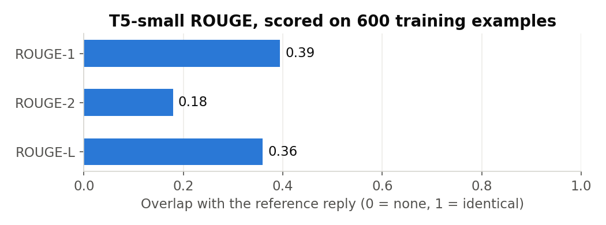
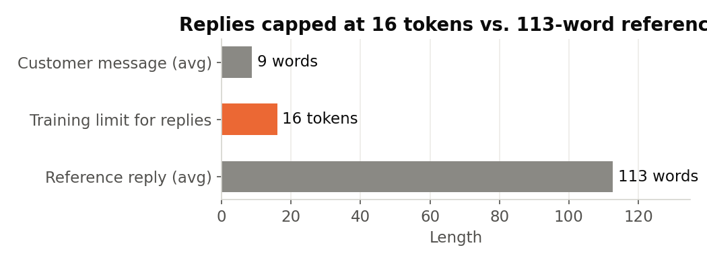

#  Hospital Customer Support Chatbot

This project is a Natural Language Processing (NLP)-based **hospital customer service chatbot**, designed to assist patients and customers with a wide range of inquiries, including appointment details, available doctors details and general inquiries

---

##  Team Members

- **Mahynour Ayman**   
- **Mariam Aly** 
- **Jana Emad**  

---

## ⚙️ Methodology

- **Text Preprocessing**: Clean and prepare user input for better model understanding.
- **Transformer Models**: Leverage pre-trained large language models for generating responses.
- **SQL Database Integration**: Simulate real-time access to patient-related information like appointment schedules.

---

## 📊 Dataset

- **Source**: [Hugging Face – Bitext Customer Support Dataset](https://huggingface.co/datasets/bitext/Bitext-customer-support-llm-chatbot-training-dataset)
- **Size**: ~26,872 records (~19.2 MB)
- **Fields**:
  - `instruction`: user request
  - `category`: high-level topic (e.g., healthcare)
  - `intent`: identified user intent
  - `response`: expected assistant reply
- **Preprocessing**: Filter dataset to focus on relevant domains (healthcare, hospitality, insurance, etc.)

---

## 🚀 Setup & Run

```bash
pip install -r requirements.txt
python -m spacy download en_core_web_lg     # ~560 MB, required — not a pip dependency
jupyter notebook NLP_Chatbot.ipynb
```

A few things worth knowing before you run it:

- **`transformers` is pinned to `4.45.2`.** The notebook was built against that
  release; later versions changed the `Trainer` and evaluation APIs, so an
  unpinned install will break the training cells.
- **The spaCy model is a separate download.** `pip install spacy` gives you the
  library but not `en_core_web_lg`, which the preprocessing cells load directly.
- **The SQLite database builds itself.** `clinic.db` (doctors, appointments) is
  created and populated by the notebook at runtime, so there is no database file
  to fetch — just run the cells in order.
- **Outputs are committed**, so you can read every result without executing
  anything.

---

## 📈 Results

The fine-tuned **T5-small** generator was trained for 3 epochs on 2,000 of the 9,588 training pairs.

<p align="center"></p>

| Metric | Score |
|---|---|
| ROUGE-1 | 0.395 |
| ROUGE-2 | 0.179 |
| ROUGE-L | 0.360 |

**Read these with two caveats:**

1. **They are scored on training examples.** In the notebook, `eval_dataset` is `train[:600]`, a slice of the same
   2,000 rows the model trained on. The validation (1,198) and test (1,199) splits exist but were never scored. On unseen
   messages the scores will be lower.
2. **Replies were cut to 16 tokens.** Tokenisation used `max_length=16` for both the question and the reply, but the
   reference replies average **113 words**. The model only ever learned how a reply *opens*, which is why demo
   answers stop mid-sentence ("i'm here to help i understand your need to…").

<p align="center"></p>

The **database half works as intended**. spaCy's entity ruler pulls out the specialisation ("cardiology"), the
query is built with parameters, and the right doctor, fee, room and day come back from SQLite.

**Next steps, in order of payoff:** score the held-out test split; raise the reply length to ~256 tokens; train on all
9,588 pairs; and switch reply generation to templates filled from the database, so facts are never generated.

---

## 💼 Business impact

**Use case: a hospital front desk.** A large share of patient calls and messages are routine: which doctor covers a
specialty, fees, room numbers, which day a clinic runs, booking changes. All of these have a correct answer in a database.

An illustrative estimate, using assumptions you can swap for real figures:

| Assumption | Value |
|---|---|
| Patient enquiries per day | 400 |
| Share that are routine look-ups (doctor / fee / room / schedule) | 40% |
| Staff time per enquiry | 2 minutes |

**≈ 160 enquiries a day → ≈ 5.3 staff-hours a day (≈ 140 hours a month over 26 working days)** that could move to self-service, with
answers available 24/7.

**What has to be true before this ships:** the database answers are reliable already. The generated wording is not
(see the caveats above). A production version should take facts *only* from SQL, use the language model just for
phrasing, and hand anything clinical to a person. That design is built and evaluated in the follow-up project
[whatsapp-clinic-assistant](https://github.com/JanaEmad1/whatsapp-clinic-assistant), which achieves 0 wrong answers.

---

## 🔗 References

- Hugging Face Datasets & Transformers  
- Bitext LLM Chatbot Training Dataset

---

## 📄 License

MIT — see [LICENSE](LICENSE).

> Built in Feb 2025 and published in June 2025. The short commit history reflects
> that it was uploaded when finished rather than developed in the open.
